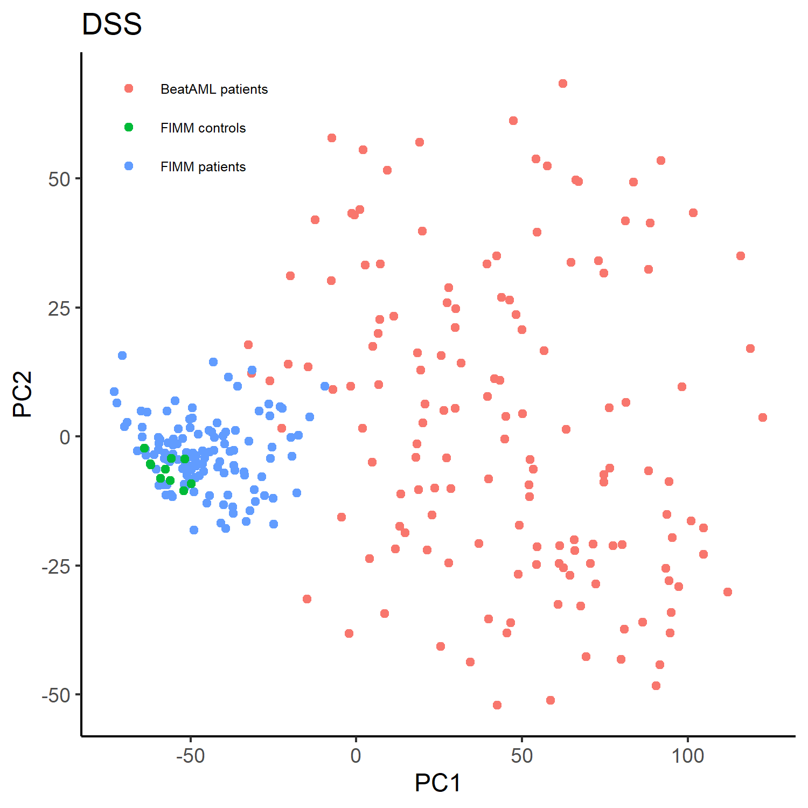

# DSS-v2.0
DSS-v2.0 is a new pipeline to better quantify selective drug responses between cancer patients and healthy controls.


# Instructions
R version 3.5.1 or newer is required.

# Under Linux/Unix
```
# download the example data and R scripts
git clone https://github.com/yingjchen/DSS-v2.0.git

# change the directory
cd ./DSS-v2.0

# start the R program
R
```

# Start by loading libraries and functions
```r
lapply(c("matrixStats","dplyr","reshape","reshape2", "scales", "drc", "caTools","ggplot2", "data.table", "stringr","MESS", "BiocManager","svMisc", "egg", "pheatmap", "sva", "pcaMethods"), library, character.only = T)

source('./DSS.R')
source('./HelperFunctions.R')
```

# Selective DSS calculation example
## Load the example data and compute DSS with *CALC_METRICS* function updated from BREEZE (<https://github.com/potdarswapnil/Breeze>)

```r
# load the ex vivo dose-response profiles (cell viability at five drug concentrations)
df_dose.responses <- read.csv('./exampleData_procedure1.csv', header = T,sep = ",",check.names = F)

head(df_dose.responses)
```

    ##    DRUG_NAME CONCENTRATION SCREEN_NAME    CELL_VIABILITY
    ## 1 Nelarabine         10000  AML_013_01            0.3012
    ## 2 Nelarabine          1000  AML_013_01            0.5565
    ## 3 Nelarabine           100  AML_013_01            0.7578
    ## 4 Nelarabine            10  AML_013_01            0.9133
    ## 5 Nelarabine             1  AML_013_01            0.8610
    ## 6 Decitabine         10000  AML_013_01            0.4829


```r
# calculate the percentage of growth inhibition 
df_dose.responses.list <- DOSE_RESPONSE_PROCESS(df_dose.responses, viability = T)

# calculate DSS metrics (DSS1, DSS2, DSS3), AUC and relative IC50
df.metrics <- CALC_METRICS(df_dose.responses.list[[1]], df_dose.responses.list[[2]])
```

## Import the control sample DSS profiles
```r
controls.dss <- read.csv('./controls/File_1_Drugname_response_DSS_10Healthy.txt', header = T, sep = '\t', row.names = 1,stringsAsFactors = F, check.names = F)
```
## Calculate the selective drug response scores(sDSS, zDSS, and rDSS)
```r
# compute the descriptive statistics of DSSs for each drug over 10 controls
controls.summary <- as.data.frame(rbind(colMeans(as.matrix(controls.dss)),colSds(as.matrix(controls.dss)),colMedians(as.matrix(controls.dss)), colMads(as.matrix(controls.dss))))

# define names of statistics
rownames(controls.summary ) <- c('mean', 'sd', 'median', 'mad')

# let's set DSS2 as the drug response metrics of patient samples (as an example)
patients.dss <- as.data.frame(acast(df.metrics,df.metrics$Patient.num ~ df.metrics$drug , value.var  = 'DSS2'))

patients.dss[, 1:3]
```
    ##                    1-methyl-D-tryptophan 4-hydroxytamoxifen 8-amino-adenosine
    ## AML_003_01                     0                9.2              25.4
    ## AML_004_01                     0                2.3              22.6
    ## AML_013_01                     0                4.3              23.9
```r
# normalize and scale patient-specific responses to drugs with control DSS profiles
# patient sDSS
patients.sdss <- patients.dss - slice(controls.summary['mean', colnames(patients.dss)],rep(1:n(), each = nrow(patients.dss)))

# patient zDSS
patients.zdss <- (patients.dss - slice(controls.summary['mean', colnames(patients.dss)],rep(1:n(), each = nrow(patients.dss))))/(slice(controls.summary['sd', colnames(patients.dss)],rep(1:n(), each = nrow(patients.dss))) + 1)

# patient rDSS
patients.rdss <- (patients.dss - slice(controls.summary['median', colnames(patients.dss)],rep(1:n(), each = nrow(patients.dss))))/(slice(controls.summary['mad', colnames(patients.dss)],rep(1:n(), each = nrow(patients.dss))) + 1)
```

# Batch effect correction example
To combine drug response profiles from multiple sources, we apply the ComBat algorithm to adjust for the known batch effects. 

```r
# load the example data: DSS2 proiles for 147 BeatAML samples, 125 FIMM-AML samples and 10 healthy controls. 
df.dss <- read.csv('./exampledata_procedure2.csv', header = T,sep = ",",  row.names = 1, check.names = F)
```
One can visualize a Probabilistic PCA (PPCA) plot showing 
the batch effects due to the presence of missing data.
```r
df.dss.1 <- df.dss[, 1 : (ncol(df.dss) - 3)]
res_ppca <- pca(data.matrix(df.dss.1), method = 'ppca', nPcs = 2, seed = 1)
score_ppca <-  as.data.frame(scores(res_ppca))
score_ppca$group <- paste(df.dss$cohort,  df.dss$status,  sep = ' ')

ggplot(score_ppca, aes(x = PC1, y = PC2, color = group)) +
  geom_point() + labs(title = "DSS",  x = "PC1", y = "PC2") +
  theme_classic()
```




Given the differences between two cohorts, let's use the ComBat function from SVA package to correct the batch effects.
```r
df.dss.combat <- ComBat(dat = t(df.dss.1), batch = as.factor(df.dss$cohort), mod = NULL, par.prior = F, prior.plots = F)
````

PPCA of ComBat-corrected DSS profiles
```r
res_ppca_combat <- pca(data.matrix(t(df.dss.combat)), method = 'ppca', nPcs = 2, seed = 1)
score_ppca_combat <-  as.data.frame(scores(res_ppca_combat))
score_ppca_combat$group <- paste(df.dss$cohort,  df.dss$status,  sep = ' ')

ggplot(score_ppca_combat, aes(x = PC1, y = PC2, color = group)) +
  geom_point() + labs(title = "ComBat DSS",  x = "PC1", y = "PC2") +
  theme_classic()
```


# Contact information
For any questions please contact **Yingjia Chen** (yingjia.chen@helsinki.fi)
